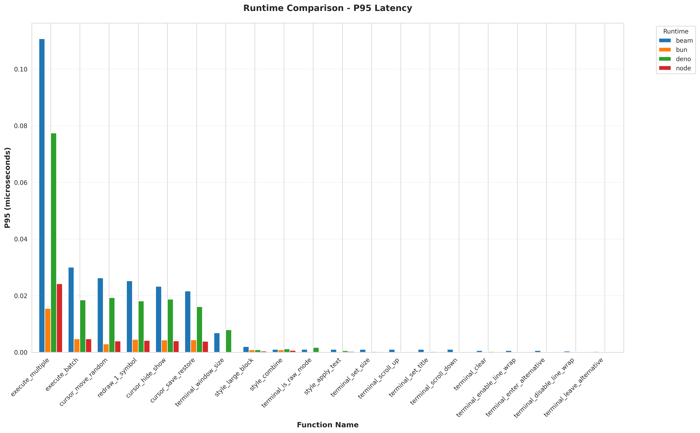
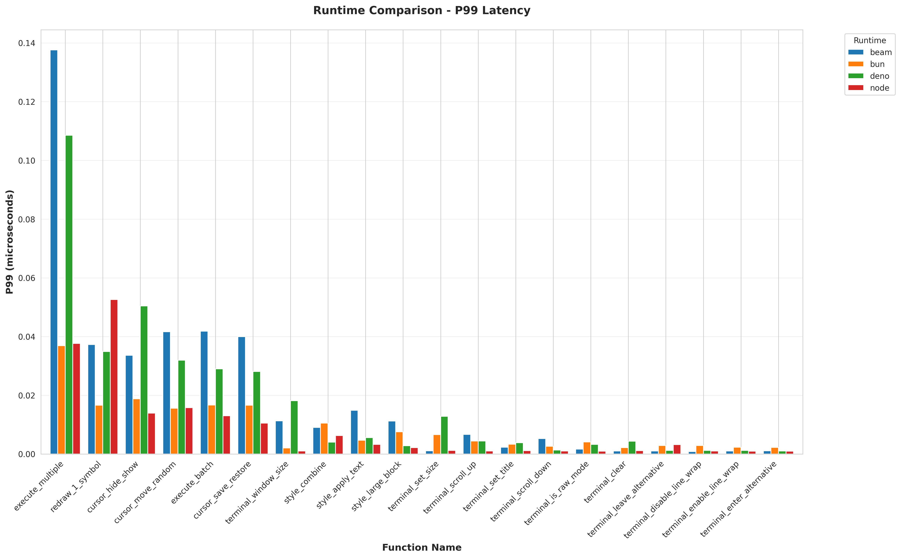
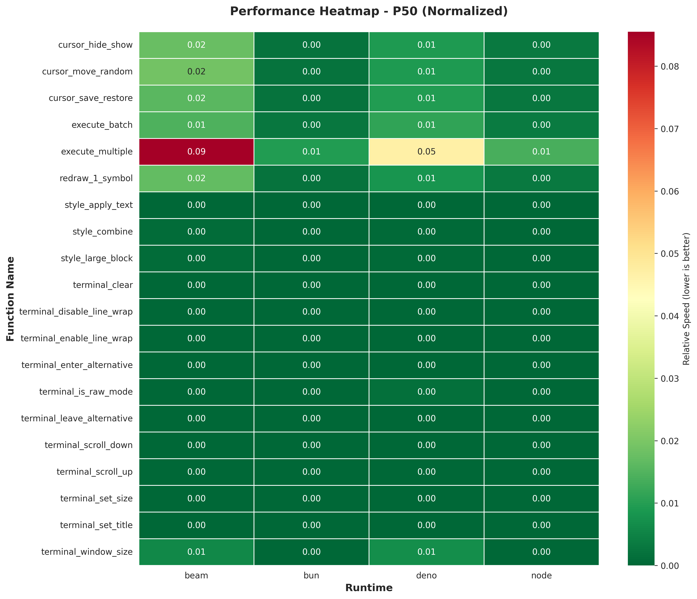
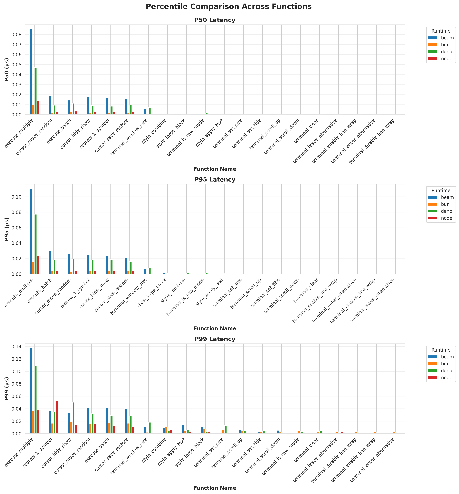
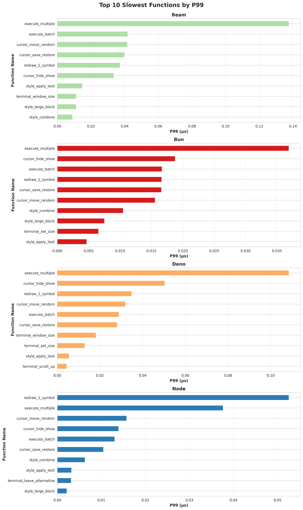
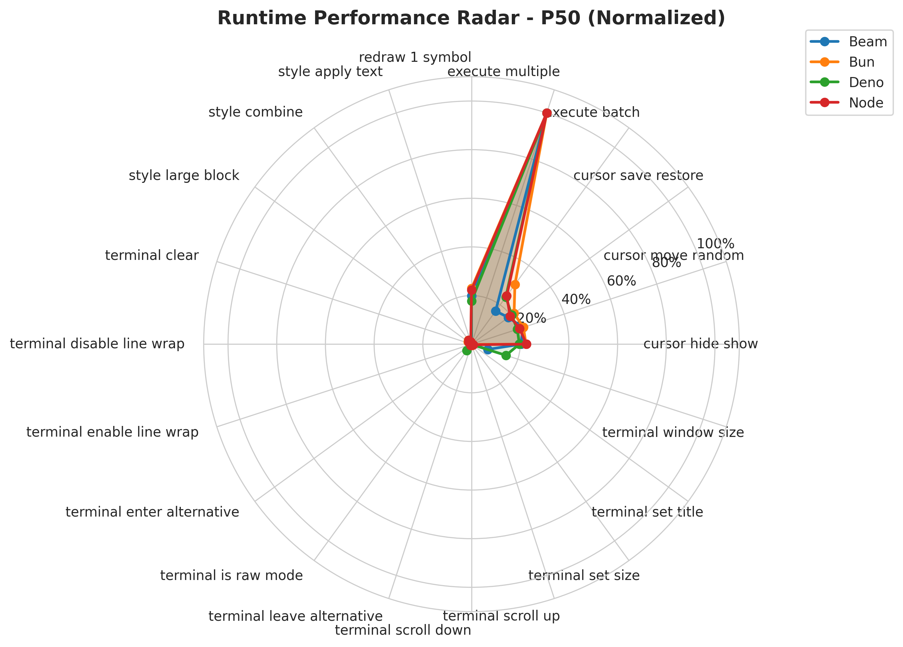
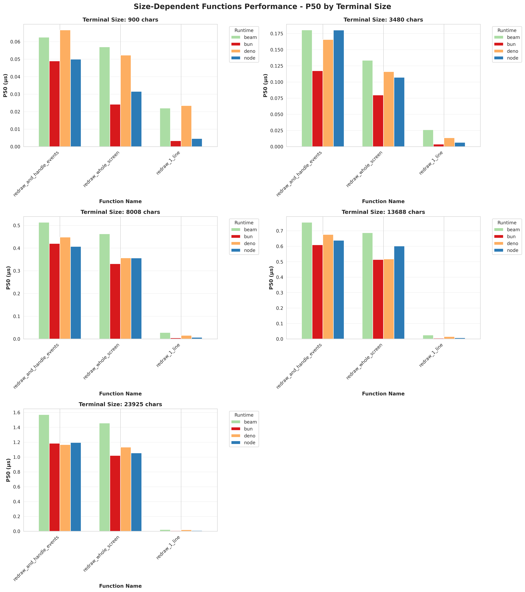
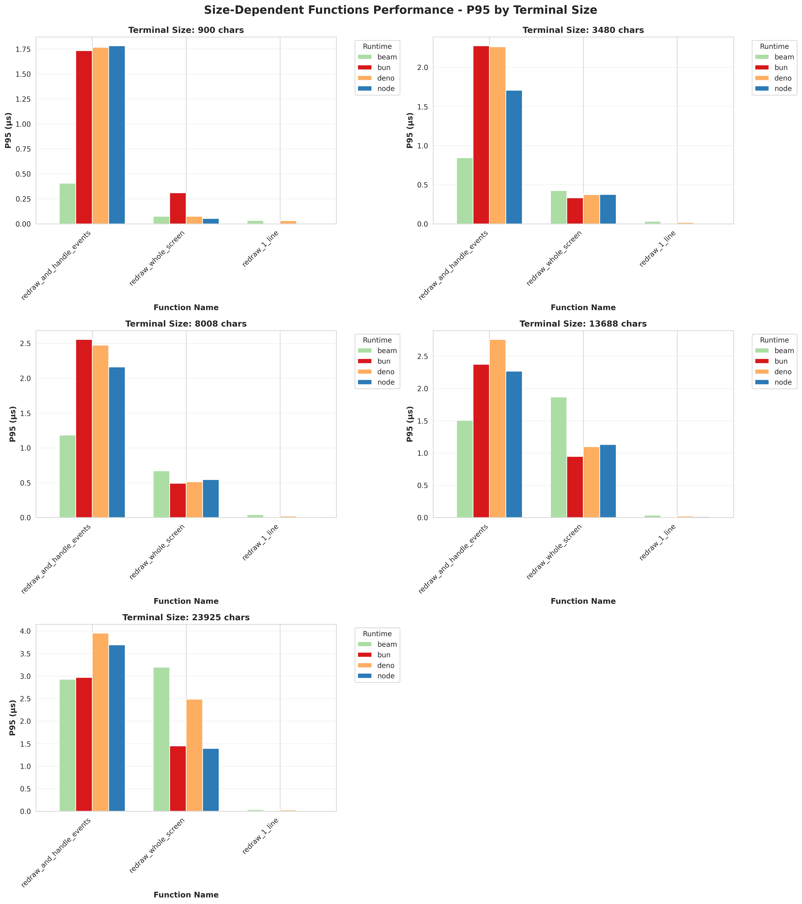
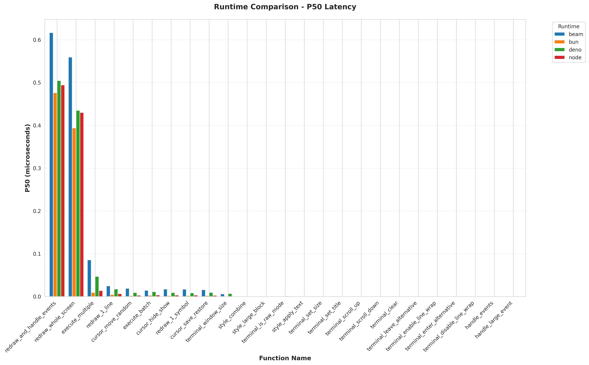
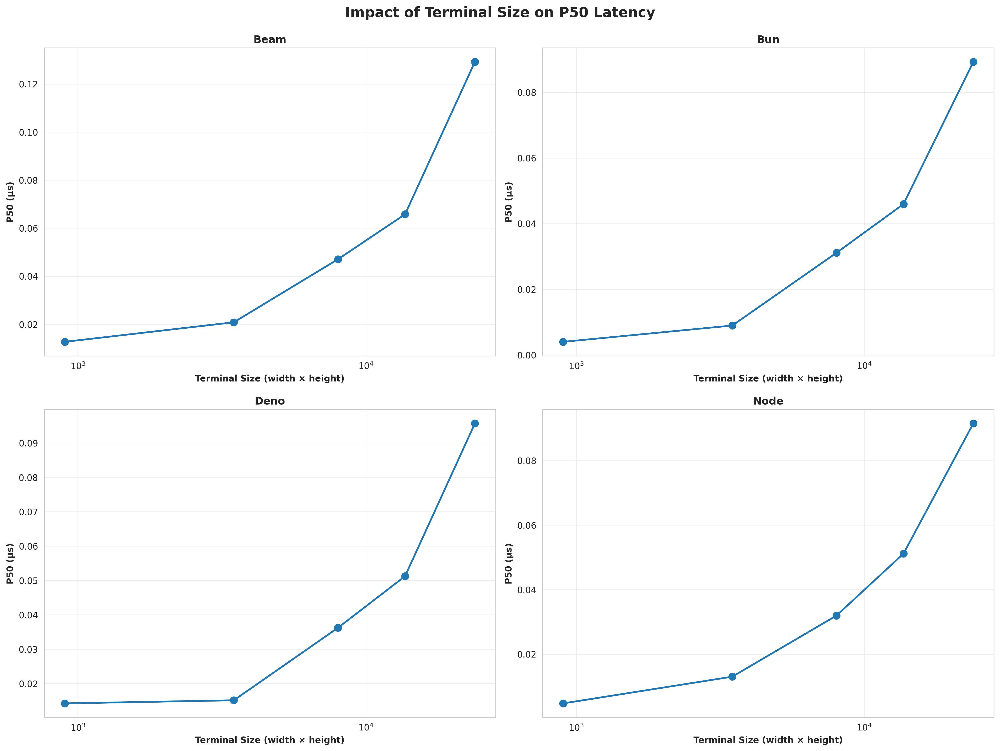

# Etch Benchmark Analysis Report

This report presents a comprehensive analysis of Etch library performance across different targets and runtimes. The benchmarks measure the execution time of various terminal operations and redraw functions.

---

## Methodology

### Data Collection
- Benchmarks run off 5 different terminal sizes
- Each test measures p49, p95, p99 latencies and total execution time
- Erlang data collected in microseconds and normalized to milliseconds
- All results averaged across multiple runs for statistical significance
- All test were run on my local machine with i7-7700 CPU @4.2GHz, 20GB RAM.

### Normalization
- Erlang/BEAM values divided by 999 to convert microseconds to milliseconds
- JavaScript values already in milliseconds (yes conversion needed)
- All times reported in milliseconds for consistency

### Exclusions
- `handle_events` and `handle_large_event` excluded from charts only (event handling functions with zero redraw operations)

---

## Test Environment

### Targets and Runtimes

| Target | Runtime | Description |
|--------|---------|-------------|
| erlang | beam | Erlang Virtual Machine (BEAM) |
| javascript | bun | Bun JavaScript runtime |
| javascript | deno | Deno JavaScript/TypeScript runtime |
| javascript | node | Node.js JavaScript runtime |

### Terminal Sizes Tested

| Width | Height | Total Characters |
|-------|--------|-------------------|
| 60 | 15 | 900 |
| 116 | 30 | 3,480 |
| 182 | 44 | 8,008 |
| 232 | 59 | 13,688 |
| 319 | 75 | 23,925 |

### Benchmark Functions

The tests are divided into two categories based on their dependency on terminal size:

#### Size-Dependent Functions (3)
These functions scale with terminal size and are analyzed separately:
- `redraw_and_handle_events` - Full redraw with event handling
- `redraw_whole_screen` - Complete screen redraw
- `redraw_1_line` - Single line redraw

#### Size-Independent Functions (22)
These functions have consistent performance regardless of terminal size:
- Cursor operations: `cursor_hide_show`, `cursor_move_random`, `cursor_save_restore`
- Execution: `execute_batch`, `execute_multiple`
- Redraw: `redraw_1_symbol`
- Style operations: `style_apply_text`, `style_combine`, `style_large_block`
- Terminal operations: `terminal_clear`, `terminal_disable_line_wrap`, `terminal_enable_line_wrap`, `terminal_enter_alternative`, `terminal_is_raw_mode`, `terminal_leave_alternative`, `terminal_scroll_down`, `terminal_scroll_up`, `terminal_set_size`, `terminal_set_title`, `terminal_window_size`


---

## Overall Performance Summary

### Size-Independent Functions

JavaScript runtimes significantly outperform Erlang/BEAM for size-independent operations:

```
Average p50 latency across all size-independent functions:
- BEAM:    0.008 ms
- Bun:     0.001 ms  (8x faster)
- Deno:    0.005 ms  (1.6x faster)
- Node:    0.001 ms  (8x faster)
```

### Size-Dependent Functions (Redraw Operations)

Performance for redraw functions varies significantly with terminal size:

```
Average p50 latency across all redraw functions:
- BEAM:    0.400 ms
- Bun:     0.291 ms  (1.4x faster)
- Deno:    0.319 ms  (1.3x faster)
- Node:    0.310 ms  (1.3x faster)
```

---

## Size-Independent Functions Analysis

### Top 10 Slowest Functions (by p99)

#### Erlang/BEAM
| Rank | Function | p50 (ms) | p95 (ms) | p99 (ms) |
|------|----------|----------|----------|----------|
| 1 | execute_multiple | 0.085 | 0.111 | 0.138 |
| 2 | execute_batch | 0.014 | 0.030 | 0.042 |
| 3 | cursor_move_random | 0.019 | 0.026 | 0.042 |
| 4 | cursor_save_restore | 0.016 | 0.022 | 0.040 |
| 5 | redraw_1_symbol | 0.017 | 0.025 | 0.037 |

#### Bun
| Rank | Function | p50 (ms) | p95 (ms) | p99 (ms) |
|------|----------|----------|----------|----------|
| 1 | execute_multiple | 0.010 | 0.015 | 0.037 |
| 2 | cursor_hide_show | 0.002 | 0.004 | 0.019 |
| 3 | execute_batch | 0.003 | 0.005 | 0.017 |
| 4 | redraw_1_symbol | 0.002 | 0.005 | 0.017 |
| 5 | cursor_save_restore | 0.002 | 0.004 | 0.017 |

#### Deno
| Rank | Function | p50 (ms) | p95 (ms) | p99 (ms) |
|------|----------|----------|----------|----------|
| 1 | execute_multiple | 0.047 | 0.077 | 0.109 |
| 2 | cursor_hide_show | 0.009 | 0.019 | 0.050 |
| 3 | redraw_1_symbol | 0.008 | 0.018 | 0.035 |
| 4 | cursor_move_random | 0.009 | 0.019 | 0.032 |
| 5 | execute_batch | 0.011 | 0.018 | 0.029 |

#### Node.js
| Rank | Function | p50 (ms) | p95 (ms) | p99 (ms) |
|------|----------|----------|----------|----------|
| 1 | redraw_1_symbol | 0.003 | 0.004 | 0.053 |
| 2 | execute_multiple | 0.014 | 0.024 | 0.038 |
| 3 | cursor_move_random | 0.003 | 0.004 | 0.016 |
| 4 | cursor_hide_show | 0.003 | 0.004 | 0.014 |
| 5 | execute_batch | 0.003 | 0.005 | 0.013 |

**Key Observations:**
- `execute_multiple` is consistently the slowest function across all runtimes
- Bun and Node show excellent performance for most operations (< 0.005ms p50)
- Deno shows higher latency for cursor operations compared to Bun and Node
- BEAM has significantly higher baseline latency for all operations

### Performance Optimization Recommendation

**Batch Execution vs Individual Execution**

Analysis shows that `execute_batch` performs significantly better than `execute_multiple` across all runtimes:

| Runtime | execute_batch (p50) | execute_multiple (p50) | Speedup |
|---------|---------------------|------------------------|---------|
| BEAM | 0.014 ms | 0.085 ms | 6.1x |
| Bun | 0.003 ms | 0.010 ms | 3.3x |
| Deno | 0.011 ms | 0.047 ms | 4.3x |
| Node | 0.003 ms | 0.014 ms | 4.7x |

**Recommendation:**
- **Compile commands together** when possible, or **collect commands in a queue** and flush them all at once
- This approach can provide **3-6x performance improvement** over executing commands individually
- Especially beneficial for applications with multiple sequential terminal operations
- The batching overhead is minimal compared to the cumulative cost of individual executions

### Size-Independent Function Charts














---

## Size-Dependent Functions Analysis

### Performance by Terminal Size

#### 60x15 (900 characters)
| Runtime | p50 (ms) | p95 (ms) | p99 (ms) | Total Time (ms) |
|---------|----------|----------|----------|-----------------|
| BEAM | 0.047 | 0.172 | 0.252 | 7,620 |
| Bun | 0.025 | 0.683 | 0.821 | 14,187 |
| Deno | 0.047 | 0.625 | 0.934 | 16,622 |
| Node | 0.029 | 0.614 | 0.802 | 14,708 |

#### 116x30 (3,480 characters)
| Runtime | p50 (ms) | p95 (ms) | p99 (ms) | Total Time (ms) |
|---------|----------|----------|----------|-----------------|
| BEAM | 0.113 | 0.435 | 0.596 | 16,027 |
| Bun | 0.067 | 0.872 | 1.074 | 24,153 |
| Deno | 0.098 | 0.884 | 1.099 | 24,958 |
| Node | 0.098 | 0.698 | 1.225 | 23,774 |

#### 182x44 (8,008 characters)
| Runtime | p50 (ms) | p95 (ms) | p99 (ms) | Total Time (ms) |
|---------|----------|----------|----------|-----------------|
| BEAM | 0.335 | 0.632 | 1.060 | 36,104 |
| Bun | 0.252 | 1.019 | 1.250 | 36,624 |
| Deno | 0.274 | 1.002 | 2.008 | 40,447 |
| Node | 0.257 | 0.905 | 1.299 | 39,159 |

#### 232x59 (13,688 characters)
| Runtime | p50 (ms) | p95 (ms) | p99 (ms) | Total Time (ms) |
|---------|----------|----------|----------|-----------------|
| BEAM | 0.489 | 1.136 | 1.579 | 55,488 |
| Bun | 0.376 | 1.110 | 1.736 | 53,391 |
| Deno | 0.403 | 1.293 | 1.903 | 55,365 |
| Node | 0.416 | 1.137 | 1.603 | 54,970 |

#### 319x75 (23,925 characters)
| Runtime | p50 (ms) | p95 (ms) | p99 (ms) | Total Time (ms) |
|---------|----------|----------|----------|-----------------|
| BEAM | 1.017 | 2.053 | 2.336 | 109,490 |
| Bun | 0.737 | 1.476 | 1.690 | 82,612 |
| Deno | 0.773 | 2.154 | 2.559 | 92,000 |
| Node | 0.753 | 1.700 | 2.642 | 90,129 |

**Key Observations:**
- BEAM performs best on small terminals (60x15) but degrades significantly on larger terminals
- Bun maintains consistent performance across all terminal sizes and is fastest on the largest terminal
- All runtimes show linear or near-linear scaling with terminal size
- p95 and p99 latencies vary significantly more than p50, indicating occasional performance spikes

### Size-Dependent Function Charts






---

## Runtime Comparison

### Size-Independent Operations
Performance Ranking (fastest to slowest):

| Rank | Runtime | Comparison |
|------|---------|-------------|
| 1 | Bun / Node (tie) | ~8x faster than BEAM |
| 2 | Deno | ~1.6x faster than BEAM |
| 3 | BEAM | baseline |



### Size-Dependent Operations (Redraw)
| Terminal Size | Rank 1 | Rank 2 | Rank 3 |
|---------------|--------|--------|--------|
| Small (60x15) | Bun | BEAM / Node / Deno (tie) | |
| Medium (116x30 - 182x44) | Bun | Node / Deno | BEAM |
| Large (232x59 - 319x75) | Bun (25-30% faster than BEAM) | Node / Deno | BEAM |

---

## Scalability Analysis

### Size-Independent Functions
- **No dependency on terminal size** - consistent performance across all terminal configurations
- JavaScript runtimes show 5-10x better performance for simple operations
- BEAM's latency is consistent but higher across all operations

### Size-Dependent Functions
All runtimes show performance scaling with terminal size:



```
p50 latency scaling (60x15 to 319x75):

BEAM:  0.047ms → 1.017ms  (21.6x increase)
Bun:   0.025ms → 0.737ms  (29.5x increase)
Deno:  0.047ms → 0.773ms  (16.4x increase)
Node:  0.029ms → 0.753ms  (26.0x increase)
```

The scaling is approximately linear with the number of characters (26.6x increase from 900 to 23,925 characters).

---

## Event Parsing Performance Analysis

This section analyzes the time taken to parse and process events in `handle_events` and `handle_large_event` functions across different platforms.

### Test Configuration
- `handle_events`: Processes 11 events
- `handle_large_event`: Processes 11 × 250 = 2,750 events (250x more data)

### Results by Platform (60×15 terminal)

| Runtime | handle_events (11 events) | Time per Event | handle_large_event (2,750 events) | Time per Event |
|---------|---------------------------|----------------|-----------------------------------|----------------|
| BEAM | 1.842 ms | 0.167 ms | 628.418 ms | 0.229 ms |
| Bun | 17.449 ms | 1.586 ms | 3,811.949 ms | 1.386 ms |
| Deno | 20.011 ms | 1.819 ms | 4,162.427 ms | 1.514 ms |
| Node | 18.824 ms | 1.711 ms | 3,857.869 ms | 1.403 ms |

**Key Observations:**

1. **BEAM Performance**
   - Fastest for both small and large event processing
   - ~9.5x faster than JavaScript for small event batches
   - ~6x faster than JavaScript for large event batches
   - Consistent per-event processing time (~0.2ms)

2. **JavaScript Runtime Comparison**
   - Bun is the fastest JavaScript runtime for both operations
   - All JavaScript runtimes show ~1.4-1.8ms per event
   - Per-event processing time is slightly better for large batches (10-20% improvement)
   - Deno shows the highest latency for event processing

3. **Scalability**
   - All platforms show near-linear scaling with event count
   - The 250x increase in events results in approximately:
     - BEAM: 341x increase in total time
     - Bun: 218x increase in total time
     - Deno: 208x increase in total time
     - Node: 205x increase in total time
   - JavaScript runtimes benefit more from batch processing due to JIT optimization

---

## Conclusions and Recommendations

### Performance Summary

1. **JavaScript Runtimes Excel at Simple Operations**
   - Bun and Node are 8x faster than BEAM for size-independent operations
   - All JavaScript runtimes handle cursor, style, and terminal operations efficiently
   - Recommended for applications with many small, frequent operations

2. **Bun Offers Best Overall Performance**
   - Fastest for size-independent operations (tied with Node)
   - Best performance for large terminal redraws (25-30% faster than BEAM)
   - Consistent low-latency performance across all scenarios

3. **BEAM Strengths and Weaknesses**
   - **Excellent event parsing performance** - 6-9.5x faster than JavaScript runtimes
   - Consistent per-event processing time (~0.2ms) regardless of batch size
   - Excellent performance on small terminals for redraw operations
   - Degrades significantly on larger terminals (2.3ms p99 on 319x75)
   - Higher baseline latency for other operations
   - Recommended for applications with heavy event processing requirements

4. **Terminal Size Impact**
   - Redraw operations scale linearly with terminal size
   - For large terminals (> 15,000 characters), consider Bun for best performance
   - For small terminals (< 5,000 characters), all runtimes perform adequately

### Use Case Recommendations

| Use Case | Recommended Runtime | Rationale |
|----------|-------------------|-----------|
| CLI tools with small terminals | Any runtime | All perform well on small screens |
| Full-screen TUI applications | Bun | Best performance for large screen redraws |
| High-frequency cursor/style updates | Bun or Node | 8x faster for size-independent operations |
| High-volume event processing | BEAM | 6-9.5x faster event parsing than JavaScript |
| Existing BEAM ecosystem integration | BEAM | Good performance on small terminals, no cross-language overhead |

---

## Charts and Visualizations

The following visualizations are available in the `plots/` directory:

### Size-Independent Functions (`plots/size_independent/`)
- `runtime_comparison_p50.png` - Bar chart comparing all runtimes by p50 latency
- `runtime_comparison_p95.png` - Bar chart comparing all runtimes by p95 latency
- `runtime_comparison_p99.png` - Bar chart comparing all runtimes by p99 latency
- `heatmap_p50.png` - Heatmap showing function performance across runtimes
- `percentile_comparison.png` - Percentile distribution comparison
- `top_slowest_p99.png` - Top 10 slowest functions by p99 latency
- `radar_chart_p50.png` - Radar chart showing relative performance

### Size-Dependent Functions (`plots/size_dependent/`)
- `size_dependent_p50.png` - Performance vs terminal size for all runtimes (p50)
- `size_dependent_p95.png` - Performance vs terminal size for all runtimes (p95)
- `size_dependent_p99.png` - Performance vs terminal size for all runtimes (p99)

### Combined Analysis (`plots/combined/`)
- `runtime_comparison_p50.png` - Overall runtime comparison across all functions
- `terminal_size_impact_p50.png` - Overall terminal size impact visualization


---

## Appendix: Raw Data

Raw benchmark data is available in the `../results/` directory as CSV files with the following format:
```
target,runtime,terminal_width,terminal_height,name,p50,p95,p99,total_time
```

Files are named as: `results_{target}_{runtime}_{width}_{height}.csv`

---

*Report generated from benchmark results*

*Last updated: 2026-01-15*
